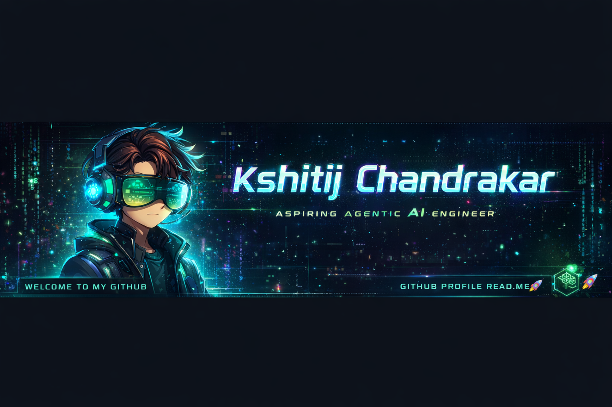

<p align="center">
  
</p>

<h1 align="center">Hi 👋, I'm Kshitij Chandrakar</h1>
<h3 align="center">🚀 Aspiring Agentic AI Engineer | Deep Learning | Computer Vision</h3>
<p align="center">⚡ Building real-world AI systems & transitioning into Agentic AI</p>

<p align="center">
  
</p>

---

## 🧠 About Me

```yaml
Name: Kshitij Chandrakar
Role: Aspiring Agentic AI Engineer
Education: B.Tech CSE (6th Semester)
Focus: Agentic AI, LLMs, Computer Vision
```

- 🎯 Goal → Build autonomous AI systems (Agentic AI)
- 🔭 Currently working on → Deepfake Video Detection (CNN + FastAPI + Streamlit)
- 🌱 Recently completed → Deep Learning
- 🤝 Open to → AI/ML collaborations & open-source
- 🛠️ Exploring → LangChain, Multi-Agent Systems
- ⚡ Strength → Turning ideas into working AI products


## 🚀 Tech Stack
<p align="center">  
</p>


## 🔥 Featured Project

### 🎥 Deepfake Video Detection System
```diff
+ Custom CNN model for deepfake detection
+ Full pipeline (video → frames → prediction)
+ FastAPI backend for real-time inference
+ Streamlit UI for user interaction
- Challenge: Overfitting & temporal consistency
```

## 📊 GitHub Stats
<p align="center">
  
  
</p>

<p align="center">
  
</p>


## 🧠 Current Focus
<p align="center">  
</p>


## 🔗 Connect With Me

<p align="center">
<a href="https://linkedin.com/in/kshitij-ai">
  
</a>
<a href="https://github.com/Kshitij-Chandrakar">
  
</a>
</p>

## ⚡ Visitor Count
<p align="center">
  
</p>

## 🚀 Roadmap

```txt
✔ Deep Learning ✅
⬜ LLMs
⬜ Agentic AI Systems
⬜ Multi-Agent Collaboration
⬜ Production AI Deployment
```

## 🐍 Contribution Snake

<p align="center">
  
</p>
